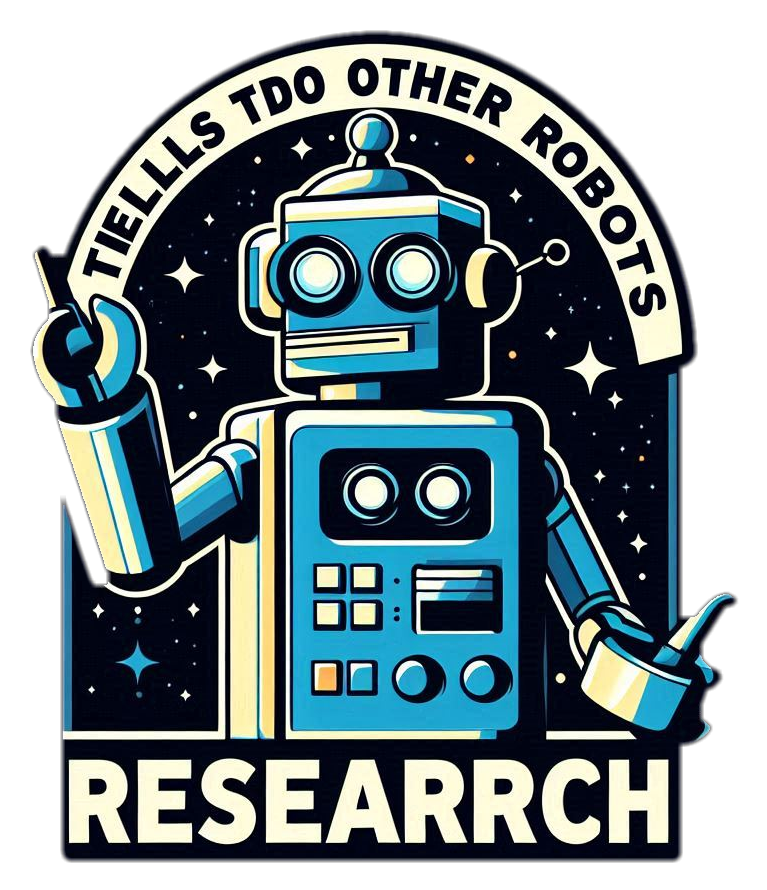
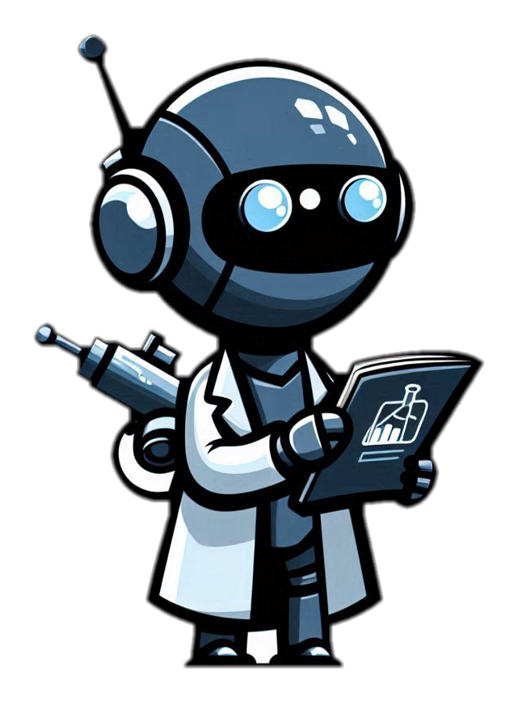
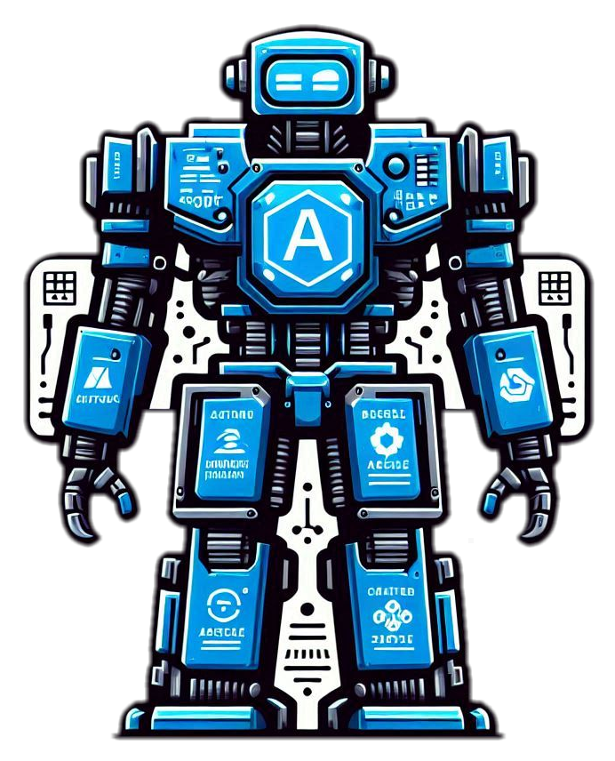

# MSFT 2024 Hackathon repository: "LetMeGoogleThatAzureQuestionForYou-Agent"

[Hackathon project site](https://hackbox.microsoft.com/hackathons/hackathon2024/project/73988)

## Introduction
Us techies in the field (CSAs and TSPs) get hammered with technical questions from customers (and colleagues) that are often just a couple of Google (or Bing :) ) searches away. The polite thing to do is to do that Google search and politely respond with a summary of your findings and some links.

__LetMeGoogleThatAzureQuestionForYou-Bot__ to the rescue! The idea is to build an AI agent that does this searching and finding of data for you and composes an answer for you to hand back.

## AutoGen

Our solution leverages [https://microsoft.github.io/autogen/](https://microsoft.github.io/autogen/). Which is explained by [Dr. Andrew Ng](https://www.andrewng.org/):

> Today, we mostly use LLMs in zero-shot mode, prompting a model to generate final output token by token without revising its work. This is akin to asking someone to compose an essay from start to finish, typing straight through with no backspacing allowed, and expecting a high-quality result. Despite the difficulty, LLMs do amazingly well at this task!
>
> With an agentic workflow, however, we can ask the LLM to iterate over a document many times. For example, it might take a sequence of steps such as:
> - Plan an outline.
> - Decide what, if any, web searches are needed to gather more information.
> - Write a first draft.
> - Read over the first draft to spot unjustified arguments or extraneous information.
> - Revise the draft taking into account any weaknesses spotted.
> - And so on.
> 
> This iterative process is critical for most human writers to write good text. With AI, such an iterative workflow yields much better results than writing in a single pass.

[Source](https://x.com/AndrewYNg/status/1770897666702233815?lang=en#:~:text=Today%2C%20we%20mostly,a%20single%20pass.)

## Agents

| Agent name       | Role    | Link   |   |
|------------------|---------|----------|---|
| Research manager | Creates the research plan, delegates the tasks and is only one to interact with 'us' | [src](./src/lmgtfu-agent/agents/research_manager.py) |  |
| Researcher       | Does research. Can search the web, read webpages and summarize content     | [src](./src/lmgtfu-agent/agents/researcher.py)      |  |
| WAF       | Expert on Azure Well Architected. Checks relevant queries for the 5-pillars     | [src](./src/lmgtfu-agent/agents/waf_expert.py)      |  |
| Critic           | Quality Assurance of the research and response. Checks whether the original question was properly answered. Whether evidence was provided, etc.     | [src](./src/lmgtfu-agent/agents/result_critic.py)      |  |

### Pre-reqs

1. VSCode
2. Docker

## Let's go

1. Open solution in VSCode
2. Open solution in DevContainer
3. 